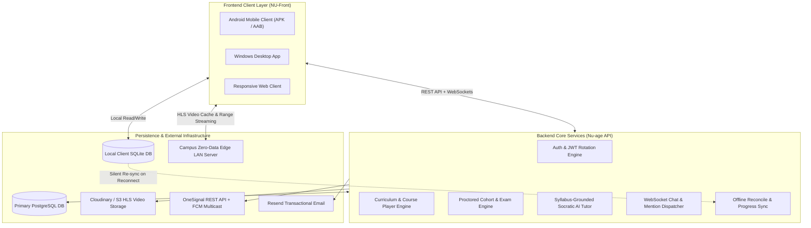

# 🌐 Nu-Age: Complete Grounding System & Feature Specification

> **Classification:** Comprehensive Technical & Functional Feature Specification  
> **Target Audience:** Engineering, Product, AI Agents, System Architects, Onboarding Developers  
> **Source Repositories:**  
> - Frontend Client: `NU-Front` (Flet 0.86.5 / Python — Android Mobile, Windows Desktop, Responsive Web)  
> - Backend Platform: `Nu-age` (FastAPI / SQLAlchemy / PostgreSQL / SQLite / OneSignal / Resend / OpenAI)  
> - Public Web & Edge Portal: `nu-web` (HTML5 / Vanilla CSS / Zero-Data Edge Architecture)  
> **Last Updated:** October 2026

---

## 1. System Mission & Architectural Foundation

Nu-Age is a **mission-engineered learning operating system** built specifically to overcome severe connectivity, hardware, and cost constraints in African higher education and emerging markets, while delivering world-class SaaS pedagogical tooling.

### Core Architectural Pillars

1. **Offline-First & Low-Bandwidth Priority**:
   - Courses (including multi-resolution HLS streaming video, PDFs, assessments, and coding sandboxes) can be downloaded in their entirety into a local SQLite database and local filesystem cache.
   - Built-in local HTTP streaming server (`local_media_server.py`) serves downloaded video segments directly on `127.0.0.1` with HTTP byte-range request support, bypassing external internet entirely.
   - Progress, quiz submissions, and completed lessons recorded offline are stored in an idempotent synchronization queue and silently reconciled the instant internet connectivity is detected.

2. **Campus Zero-Data Edge LAN Integration**:
   - Designed to peer with local campus edge servers deployed in university hostels and lecture theatres.
   - Enables high-speed LAN synchronization of heavy course assets with zero mobile data charges.

3. **Multi-Platform Adaptive UI Engine**:
   - Built on Flet 0.86.5 with strict responsive breakpoints:
     - **Mobile (< 768px)**: Adaptive bottom sheets, bottom dock AI assistant with 1-tap fullscreen overlay, touch gestures, full-width cards, compact bottom navigation bar (`PersistentBottomAppBar`).
     - **Tablet (768px – 920px)**: Collapsible navigation rail, adaptive grid columns.
     - **Desktop (>= 920px)**: Permanent syllabus sidebars, raised right-hand AI study companion dock, dual-pane layouts.

---

## 2. User Personas, Roles & Access Control

Nu-Age operates a multi-tenant, role-based security model across three principal user classes:

| Persona / Role | System Enum | Primary Workspaces & Capabilities |
| :--- | :--- | :--- |
| **Student / Learner** | `Roles.STUDENT` (`"Student"`) | Course discovery, interactive lesson viewer, code playground, 24/7 Socratic AI Tutor, module Q&A discussions, cohort exams, study flashcards, daily streaks, verifiable certificates. |
| **Instructor / Educator** | `Roles.TEACHER` (`"Teacher"`) | Visual Course Builder, interactive assessment authoring, cohort scheduling, assignment grading, proctored exam setup, student drop-off analytics, announcement broadcasts. |
| **Institution Administrator** | `Roles.ADMIN` (`"Admin"`) | Organization portal (`org_view.py`), department hierarchies, faculty assignments, bulk student roster invitations, verified digital credentials, campus-wide learning telemetry. |
| **Platform Superadmin** | `Global Superadmin` | Global control tower (`platform_admin_view.py`), organization onboarding approval, content moderation, system health monitoring. |

---

## 3. Detailed Feature Specifications by Domain

---

### Feature Domain 1: Authentication, Onboarding & Security

#### 1.1 Secure Registration & Branching Onboarding (`signup.py`, `users.py`)
- **Pre-Signup Persona Assessment**:
  - Interactive 3-card decision selector explaining platform capabilities for Students, Instructors, and Institution Admins.
  - One-tap interest and focus selection seeds initial personalization.
- **Streamlined Minimal Registration**:
  - Branching form displaying only essential inputs based on the chosen path:
    - *Student*: Full Name, Username, Email, Password, optional University.
    - *Instructor*: Full Name, Username, Email, Password, optional Institution Affiliation.
    - *Admin*: Full Name, Username, Email, Password, Organisation ID / Code.
  - Role pre-configured with seamless 1-tap switching without resetting entered data.
  - Password strength validation and confirm-password match check.
  - Clickable Terms and Privacy Policy acceptance.
- **6-Digit Cryptographic Email OTP Verification**:
  - Verification codes generated and dispatched via Resend transactional email (`signup_otps` table with 15-minute expiration).
  - Resend countdown timer (30s rate-limiting) and input auto-sanitization.
- **Dedicated Account Confirmation & Welcome Screen**:
  - Displays verified checkmark, registered handle (`@{username}`), email, verified role badge, and tailored next-steps summary.
  - 1-click handoff to Login with username/email automatically prefilled in `page.session.store`.

#### 1.2 Authentication & Session Lifecycle (`Login.py`, `auth_session.py`, `main.py`)
- **Dual-Token JWT Rotation**:
  - Short-lived Access Tokens (60m lifespan) and rotating Refresh Tokens with cryptographic reuse detection.
  - Transparent silent token refresh executed before protected requests expire.
- **Background Keep-Alive Heartbeat**:
  - Automated 30-second heartbeat ping (`keep_alive` task) that proactively refreshes access tokens older than 40 minutes to prevent mid-session drops.
- **Non-Destructive Navigation Fallback (`restore_previous_or_fallback`)**:
  - Resilient route failure recovery: If an API call fails during navigation, the application pops the skeleton, restores the previous view, updates `page._Page__last_route`, syncs the client router across all platforms via `push_route`, and displays a floating non-blocking SnackBar.
- **Theme Persistence**:
  - High-contrast Light Mode (`#FAFAFA`, `#035800` primary) and True Dark Mode (`#121212`, `#4CAF50` primary) persisted in `shared_preferences`.

---

### Feature Domain 2: Action-Oriented Dashboard & Home Cockpit

#### 2.1 Action Cockpit (`dashboard.py`, `next_best_action_card.py`)
- **"Next Best Action" Dynamic Hero**:
  - Evaluates learner state and presents the single highest-priority learning task:
    - *In-Progress Course*: **"Continue Module X: [Lesson Title]"** with radial progress indicator, estimated time remaining, and offline status indicator.
    - *Upcoming Assessment*: Timed quiz deadline alert with direct launch action.
    - *Fresh Enrollment*: Starter sprint / diagnostic lesson card.
- **Quick Launch Hub (`quick_hub.py`)**:
  - Rapid shortcuts to AI Study Hub, Campus Network, Offline Downloads, and Course Catalog.
- **Continue Learning Carousel (`enrolled_card.py`)**:
  - Multi-course progress tracker showing thumbnail, completed lesson ratio, active module name, and 1-tap resume.
- **Streak & Motivation Engine**:
  - Daily login streak tracking, milestone badges, motivational progress banners.
- **Cohort Announcements Feed**:
  - Priority broadcast notifications from course teachers and department heads.

---

### Feature Domain 3: Unified Course Learning Experience & Player

#### 3.1 3-Tab Focused Player (`course_page.py`, `course_tabs.py`)
- **Learn Tab**:
  - Dynamic lesson body, module breadcrumb navigation, and sequential lesson progress bar.
  - Action footer: Synchronized "Previous", "Next Lesson", "Submit Assessment", or "Finish Course" buttons with double-tap guards and loading spinners.
- **Practice Tab (`build_practice_tab_view`)**:
  - Interactive exercise hub listing all formative quizzes, code challenges, and exercises grouped by module with completion status tags.
  - Deep-link jumps directly to the selected exercise within the player.
- **Discuss Tab (`build_discuss_tab_view`, `discussions.py`)**:
  - Full-featured, contextual course Q&A discussion board anchored to the course and modules.
  - Categorized threads: "Question", "General Discussion", "Idea", "Help Needed".
  - Strict Author-Only "Mark as Solved" toggle permissions.
  - Nested replies, author badges, and push notification triggers for thread participants.

#### 3.2 Comprehensive Multi-Modal Lesson Renderers (`CONTENT_RENDERERS`)
Nu-Age supports seven specialized pedagogical lesson types:

1. **Adaptive HLS Video (`adaptive_video_player.py`)**:
   - Master and variant `.m3u8` playlist resolution with automatic or manual quality selection (360p, 480p, 720p, 1080p).
   - Playback speed control (0.75x, 1.0x, 1.25x, 1.5x, 2.0x), 10-second skip forward/back, and fullscreen mode.
   - Seamless offline playback fallback via local HTTP streaming server.
2. **Interactive Coding Sandbox (`code_lab`, `code_runner.py`)**:
   - In-memory execution sandbox supporting Python (AST-validated safe local sandbox), SQLite (in-memory database creation and SQL querying), and remote compiled languages via Judge0 (C++, C, Java, JavaScript, TypeScript, Rust, Go).
   - Live program input (`stdin`) input card, live execution console output, and automated test cases validation banner.
   - HTML/PWA Live Browser Preview modal for web development courses.
3. **Assessment & Quizzes (`assessment`)**:
   - Single-choice (Radio) and multi-choice (Checkbox) formative assessments.
   - Automated server-side grading, instant score calculation (70% passing threshold), detailed question-by-question review breakdown, and retry locks.
4. **Interactive Scenarios (`scenario`)**:
   - Branching decision trees with realistic real-world consequences and explanations.
5. **Procedural Steppers (`stepper`)**:
   - Sequential, step-by-step procedural guides for complex concepts.
6. **Sequencers (`sequencer`)**:
   - Drag-and-drop chronological and algorithmic order sorting challenges.
7. **Cloze Fill-In-The-Blank (`cloze`)**:
   - Text comprehension challenges with missing keyword insertion.

#### 3.3 Curriculum Progression & Verified Certificates (`certificate.py`)
- **Module Unlock Progression (`recalculate_locks`)**:
  - Sequential unlocking prevents students from skipping foundational prerequisites unless previous modules are completed.
- **Cryptographic Credential Minting**:
  - Verifies 100% completion across all modules and lessons.
  - Generates verifiable certificate with unique UUID credential ID, verified recipient name, instructor signature, completion date, and shareable verification URL.

---

### Feature Domain 4: Syllabus-Grounded AI Study Companion (Nu-AI Tutor)

#### 4.1 Real-Time Floating & Docked Assistant (`need_help_drawer.py`)
- **Adaptive Docking**:
  - Desktop: Sleek raised right-hand companion dock (`width = 400px`) with drop shadow and anti-aliased card boundary.
  - Mobile: Collapsible bottom dock (`height = 49%` viewport) with 1-tap minimize pill (`[ ✨ Nu-AI Tutor · Tap to expand ]`).
  - Mobile Fullscreen Overlay: 1-tap fullscreen expansion (`FULLSCREEN_ROUNDED`) that animates upwards to fill the viewport (`top=8, bottom=8, left=8, right=8`) without cutting off the header or prompt chips, with 1-tap minimize restoration.
- **Dynamic Context Grounding**:
  - Automatically receives active course title, module title, lesson title, and excerpted lesson content.
  - Module switching hook (`update_module_context`): Updates context dynamically when students switch syllabus topics without closing the chat.
- **Socratic Assessment Guardrails**:
  - When viewing an assessment, quiz, or test:
    - Amber badge displayed: `[ 🛡️ Assessment Mode ]`.
    - Suggestion prompt chips swap to conceptual reasoning: *"💡 Explain concept"*, *"🔍 Similar example"*, *"📖 Key rules"*, *"🤔 How to approach?"*.
    - Socratic pedagogical directives strictly refuse to give direct answers or option letters, guiding the learner through step-by-step critical thinking.
- **Dual AI Engine**:
  - Primary: High-speed OpenAI API pipeline with conversation history tracking.
  - Offline / Network Failure Fallback: Local pedagogical heuristic generator ensuring continuous assistance even during internet outages.
- **Assistant Message Actions**:
  - 1-click clipboard copy (`safe_set_clipboard`) with toast confirmation.
  - Regenerate turn button.
  - Helpful feedback thumbs-up indicator.
  - Session-wide chat history persistence and clear-conversation action.
  - Horizontally scrollable prompt chip rows preventing mobile container overflow.
  - Multi-line bubble wrapping (`_get_max_user_bubble_width`) preventing long student queries from bleeding off-screen.

---

### Feature Domain 5: Autonomous AI Self-Study Hub

#### 5.1 Self-Study Center (`self_study.py`)
- **Smart Flashcard Deck Engine (`study_flashcards.py`)**:
  - Topic-based or custom prompt flashcard generation.
  - Interactive 3D card flip animation, card navigation, and "Got it" / "Review again" mastery tracking.
- **Concept Breakdown & Real-World Analogy Generator**:
  - Generates simple analogies, core formulas, key takeaways, and common student pitfalls for any entered academic topic.
- **Interactive Practice Quizzes (`study_quiz.py`)**:
  - Instant on-demand quiz generation with customized difficulty and question count.
  - Instant answer validation and detailed explanations.
- **Timed Exam Simulator (`study_exam.py`)**:
  - Full-length simulated mock exam environment with question timers and end-of-exam performance review.

---

### Feature Domain 6: Proctored Cohort & Examination Suite

#### 6.1 Cohort Architecture (`cohorts.py`, `cohort_page.py`, `cohorts_hub.py`)
- **Cohort Lifecycle**:
  - Cohort creation, term start/end dates, max student capacity, enrollment codes, and syllabus milestones.
  - Student roster management, individual progress monitoring, and instructor assignment.
- **Proctored Exam Runner (`cohort_exam_runner.py`, `cohort_exam_view.py`)**:
  - **Full-Screen Lockdown**: Native window fullscreen enforcement with `prevent_close = True` and escape-prevention alerts.
  - **Integrated Scientific & Graphing Calculator (`exam_calculator.py`)**:
    - Floating movable calculator supporting standard arithmetic, trigonometry (sin, cos, tan), square roots, logarithms, powers, and memory functions.
  - **Live Exam Countdown**:
    - Synchronized countdown timer with amber/red urgency alerts and automatic submission upon expiration.
  - **Navigation & Question Matrix**:
    - Question palette displaying answered, unanswered, and flagged questions.
    - "Flag for Review" toggle allowing learners to revisit uncertain answers before final submission.
  - **Exam Results & Performance Review**:
    - Immediate score percentage, pass/fail status, and breakdown dialog.

---

### Feature Domain 7: Visual Course Authoring & Curriculum Builder

#### 7.1 Course Studio (`course_builder.py`, `create_course.py`)
- **Course Metadata & Asset Management**:
  - Title, description, category assignment, difficulty level (Beginner, Intermediate, Advanced), cover image upload.
- **Curriculum Hierarchy Builder**:
  - Dynamic creation of Modules and Lessons.
  - Module reordering and lesson drag-and-drop positioning.
- **Interactive Lesson Type Authoring**:
  - Dedicated editors for Video URLs, Markdown reading notes, Assessment questions, Scenarios, Steppers, Sequencers, and Code Labs.
  - Built-in live preview tab allowing instructors to test lessons exactly as students will experience them before publishing.
- **Course Settings & Access Control (`course_settings.py`, `course_stats.py`)**:
  - Course visibility (Public, Organisation Only, Private Cohort).
  - Enrollment caps, prerequisite courses, and passing thresholds.

---

### Feature Domain 8: Curated Career Learning Paths (Playlists)

#### 8.1 Learning Paths (`playlists.py`, `playlist_view.py`, `playlist_builder.py`)
- **Curated Multi-Course Roadmaps**:
  - Structured sequences of courses designed to guide students from zero to job-readiness in specific careers (e.g. "Full-Stack Web Development", "Cloud Architecture").
- **1-Tap Path Bulk Enrollment**:
  - Single enrollment button automatically enrolls the learner into all underlying courses in the playlist simultaneously.
- **Resume Learning Routing**:
  - Automatically detects the user's progress across the playlist and routes them directly to the first unfinished lesson in the active course.
- **Playlist Analytics (`playlist_analytics.py`)**:
  - Tracks cohort-wide completion rates, student drop-off bottlenecks, and average days to path completion.

---

### Feature Domain 9: Multi-Tenant Institutional Portals

#### 9.1 Organization Management (`organisations.py`, `org_view.py`)
- **Institutional Workspace**:
  - Multi-tenant architecture allowing universities, polytechnics, and corporate training academies to manage their own private portals.
  - Department and faculty structuring.
- **Member Roster & Bulk Onboarding (`invite_members.py`, `member_invite_view.py`)**:
  - Member search, role promotions (Student, Instructor, Department Admin).
  - Bulk email invite system and unique alphanumeric join codes.
- **Organization Course Catalogs (`org_course_card.py`)**:
  - Private courses accessible exclusively to verified members of the organization.
- **Campus Analytics Dashboard**:
  - Aggregate metrics on active learners, course completions, assessment scores, and department performance rankings.

---

### Feature Domain 10: Real-Time Community & Chat System

#### 10.1 Multi-Channel Messaging Engine (`chat.py`, `chat_view.py`)
- **Four Channel Types**:
  1. `course`: Auto-generated cohort discussions bound to a course.
  2. `organisation`: Campus-wide announcement and discussion forums.
  3. `custom`: Tutor-created study squads and project channels.
  4. `direct`: 1-on-1 private peer messaging.
- **Real-Time Communication**:
  - Full-duplex WebSocket architecture with live typing indicators, delivery confirmations, and presence tracking.
- **Rich Media & Attachments**:
  - Image, document, and code snippet uploads with preview cards.
- **Intelligent Anti-Spam & Notifications Invariants**:
  - Senders unconditionally excluded from push notifications.
  - Chat mention deduplication resolves all `@handles` and `@admin` tags to unique user UUIDs before single-pass dispatch.
  - Push collapse keys (`collapse_id=f"chat_{channel_id}"`) prevent multiple consecutive messages from flooding the device notification tray.

---

### Feature Domain 11: Campus Social Network & Study Squads

#### 11.1 Peer Discovery & Networking (`network.py`)
- **Student Directory**:
  - Browse verified students and instructors across departments and institutions.
- **Study Partner Matching**:
  - Recommends peers enrolled in the same courses with similar study schedules.
- **Public Learning Profiles (`member_profile.py`, `profile.py`, `edit_profile.py`)**:
  - Displays verified credentials, enrolled courses, learning streaks, bio, and social links.

---

### Feature Domain 12: Offline Engine & Silent Synchronization

#### 12.1 Local SQLite & Asset Pipeline (`local_db.py`, `download_manager.py`)
- **Comprehensive Offline Bundle**:
  - Downloads full course manifests, module/lesson trees, inline texts, and external binary assets.
- **Multi-Threaded HLS Stream Downloader**:
  - Concurrently fetches master playlists, variant streams, and `.ts`/`fMP4` segments (`HLS_CONCURRENCY = 6`), maintaining strict relative filesystem paths for offline player resolution.
- **Zero-Latency In-Memory Sandboxes**:
  - Python AST-checked execution and SQLite query runner operate 100% offline with zero network latency.
- **Silent Background Re-Sync (`progress_sync.py`)**:
  - Idempotent local queue logs all completed lesson IDs and quiz scores during offline sessions.
  - Automatically dispatches bulk sync upon internet restoration without disturbing active study sessions.
- **Offline Course Management (`offline_courses_view.py`, `offline_course_page.py`)**:
  - Storage consumption indicators, disk cleanup management, and standalone offline player view.

---

### Feature Domain 13: Push & In-App Notification Center

#### 13.1 Multi-Carrier Notification Center (`notifications.py`, `notifications_view.py`, `notifications_drawer.py`)
- **Unified Delivery Engine**:
  - Primary: OneSignal REST API targeted by external user ID aliases (`include_aliases: {"external_id": [...]}`).
  - Fallback: Direct Firebase Cloud Messaging (FCM) multicast fallback.
  - Relational: In-app database notifications table with read/unread tracking and real-time badge counters.
- **Contextual Notification Triggers**:
  - Discussion question replies, course announcements, cohort exam schedule alerts, credential issuance, and assignment grades.
- **Deep Linking**:
  - One-tap navigation directly opens the referenced discussion thread, lesson, or course tab.

---

### Feature Domain 14: Global Platform Administration Tower

#### 14.1 Superadmin Center (`platform_admin.py`, `platform_admin_view.py`)
- **System Telemetry & Health Monitoring**:
  - Live server status, active database connections, storage utilization, and API error rates.
- **Global User & Organization Moderation**:
  - Search and manage all registered users, reset accounts, grant superadmin privileges.
  - Review and approve organization onboarding applications.
- **Curriculum Moderation**:
  - Global course catalog audit, flagging, and public marketplace publishing approval.

---

## 4. Complete Technical Asset & File Inventory

### `NU-Front/src/` (Client Application)

| File | Primary Responsibility |
| :--- | :--- |
| `main.py` | Universal app shell, route change listener, responsive themes, keep-alive heartbeat, route fallback resync. |
| `Login.py` | Secure login view, credentials validation, password visibility, login prefill integration. |
| `signup.py` | 4-stage role-aware registration flow, persona assessment, branching form, OTP verification, confirmation screen. |
| `dashboard.py` | Action-oriented learner cockpit, Next Best Action hero, continue learning carousel, streak counters. |
| `course_page.py` | 3-tab course player (Learn, Practice, Discuss), multi-modal lesson renderer, progress tracking, certificate minting. |
| `course_builder.py` | Visual course curriculum builder, lesson authoring, interactive sandbox preview, assessment creator. |
| `cohort_page.py` & `cohorts_hub.py` | Cohort management hub, exam scheduling, student progress monitoring. |
| `cohort_exam_runner.py` | Full-screen proctored examination runner with anti-tamper guards, question palette, auto-submit. |
| `need_help_drawer.py` | Floating & docked syllabus-grounded Nu-AI Tutor, Socratic anti-cheating mode, mobile fullscreen overlay. |
| `self_study.py` | Autonomous AI Study Hub: smart flashcards, concept analogies, practice quizzes, exam simulator. |
| `download_manager.py` | Offline HLS video and course downloader, progress polling, asset path rewriting. |
| `local_db.py` | Local SQLite schema, offline course storage, progress sync queue. |
| `local_media_server.py` | Background HTTP server serving downloaded HLS video segments locally on `127.0.0.1`. |
| `chat_view.py` | Full-duplex WebSocket chat client, multi-channel switching, typing indicators, attachments. |
| `org_view.py` | Multi-tenant organization administrative portal, department rosters, cohort oversight. |
| `invite_members.py` | Bulk member invitation generator, cryptographic join links. |
| `network.py` | Campus social directory, peer study partner matching, classmate discovery. |
| `playlist_view.py` | Multi-course career learning path roadmap, single-tap path enrollment, sequence tracker. |
| `platform_admin_view.py` | Global superadmin telemetry, organization approval queues, user management. |
| `notifications_view.py` | In-app notification center, read/unread status, deep-link navigation. |
| `utils/code_runner.py` | Safe AST-checked Python sandbox, in-memory SQLite sandbox, Judge0 remote sandbox integration. |
| `utils/file_opener.py` | Universal clipboard helper, snackbar toasts, file system integration. |

---

### `Nu-age/routers/` (Backend API Services)

| Router | Endpoints & Capabilities |
| :--- | :--- |
| `users.py` | User registration, email OTP verification, resend OTP, current user profile, avatar upload, password update. |
| `courses.py` | Course publishing, catalog discovery, ratings, progress recalculation, completion locks. |
| `curriculum.py` | Module & lesson CRUD, lesson type handlers (video, reading, quiz, code_lab, scenario, stepper, cloze). |
| `discussions.py` | Course Q&A forum topics, replies, category filters, author-only solved toggle, push notifications. |
| `cohorts.py` | Cohort CRUD, student enrollment, proctored exam sessions, question banks, grading, rubric evaluations. |
| `study.py` | Socratic AI Tutor API, assessment guardrail prompt engineering, concept generation, flashcard creation. |
| `chat.py` | WebSocket chat connection, channel history, mention resolution, push notification dispatch with collapse keys. |
| `certificate.py` | Cryptographic certificate minting, credential UUID validation, verified PDF export. |
| `enrollments.py` | Student course enrollments, completion verification, progress sync reconciliation. |
| `playlists.py` | Career path creation, single-tap multi-course enrollment, sequence roadmap tracking. |
| `organisations.py` | Organization CRUD, department structuring, member rosters, bulk invite links. |
| `network.py` | Campus network directory, classmate discovery, study partner recommendations. |
| `notifications.py` | In-app notification fetching, read status updates, device push token registration. |
| `platform_admin.py` | Global superadmin controls, system metrics, organization approval, content moderation. |
| `media.py` | Cloudinary asset uploads, video streaming URL resolution. |

---

## 5. Architectural Invariants & Development Rules

### 1. Frontend Rules (Flet 0.86.5)
- **Do Not Modify for Deprecations**: Never rewrite existing code solely for Flet deprecation notices (`ElevatedButton`, `go()`, `shared_preferences`). Focus strictly on runtime stability.
- **Border Radius**: Use `ft.BorderRadius.all(...)`, `ft.BorderRadius.only(...)`, or numeric values. Never call `ft.border_radius`.
- **Image Fitting**: Use `ft.BoxFit.CONTAIN`, `ft.BoxFit.COVER`. Do not use `ft.ImageFit`.
- **Services vs Controls**: `ft.FilePicker` and `ft.Clipboard` are Services. Never append them to `page.controls` or `page.overlay`.
- **Containers & Constraints**: `ft.Container` in Flet 0.86.5 does NOT support `constraints=ft.BoxConstraints(...)`. Use explicit `width`, `height`, or flex `expand=True`.
- **Navigation Resync Invariant**: When restoring a previous view on navigation failure, always update `setattr(page, "_Page__last_route", page.route)` and call `await page.push_route(page.route)` on all platforms to prevent the client router from dropping subsequent clicks.

### 2. Backend Rules (FastAPI & Push Delivery)
- **Config Single Source of Truth**: All environment settings must reside in `database.py:Settings` with `SettingsConfigDict(extra="ignore")`.
- **Decoupled Delivery**: OneSignal push dispatch and database writes must remain decoupled; logging errors must never abort push notifications.
- **Anti-Spam & Deduplication**:
  - OneSignal is the primary carrier; FCM multicast is strictly a backup when OneSignal fails (`if not onesignal_sent`).
  - Senders are unconditionally excluded from push delivery.
  - Chat and discussion notifications must include grouping keys (`collapse_id=f"chat_{channel_id}"`, `collapse_id=f"disc_{topic_id}"`) to prevent notification tray spam.
  - Asynchronous acceptance: A 200/201 response from OneSignal with a valid `id` is a success; do not treat `recipients: 0` as failure because recipient evaluation is asynchronous.

---

## 6. Summary: The Nu-Age Moat

Nu-Age combines the rich interactive pedagogical depth of modern learning platforms (Coursera, Khan Academy, Duolingo) with **uncompromising offline and edge-native resilience** designed specifically for real-world emerging market infrastructure. Every subsystem—from AST-checked Python sandboxes to Socratic AI Tutor guardrails and cryptographic certificates—is engineered to function reliably regardless of whether a student has high-speed fiber or intermittent 2G edge connectivity.
